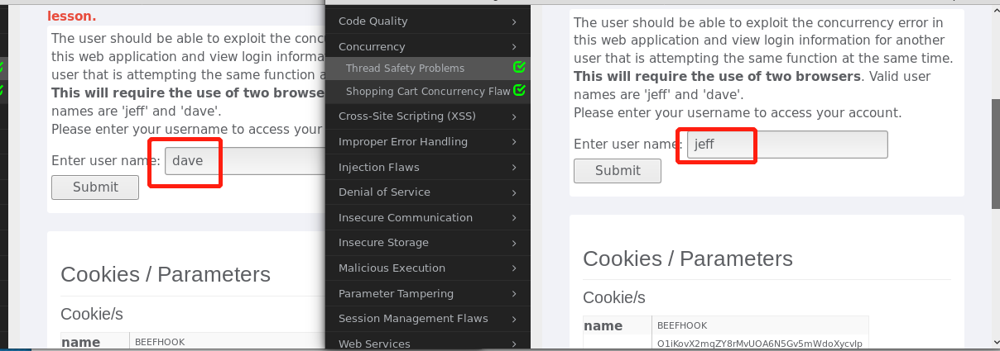
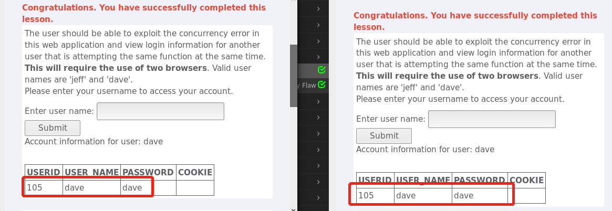
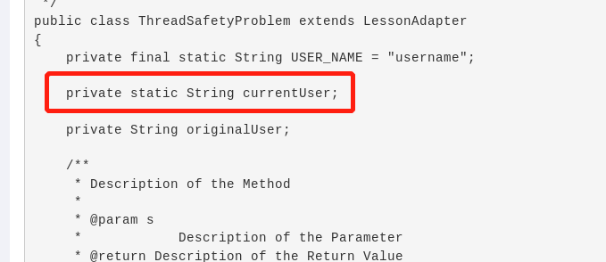
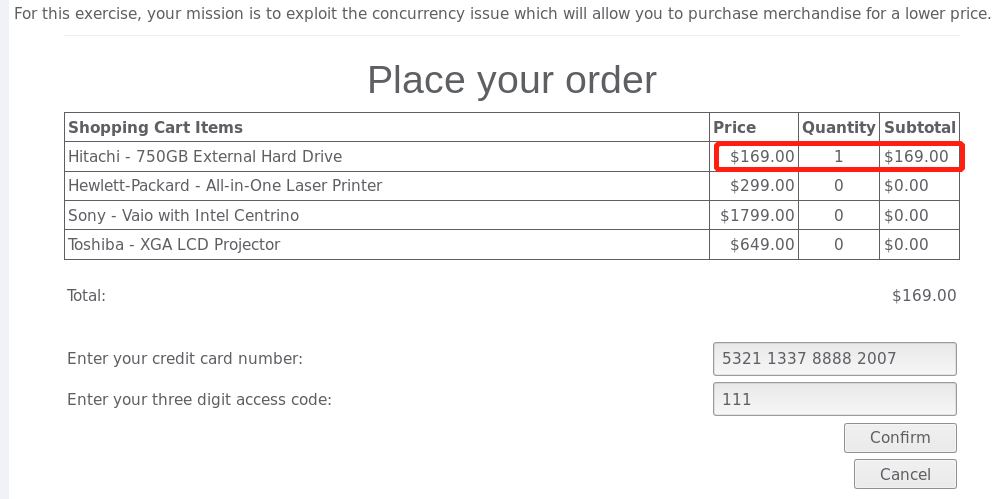
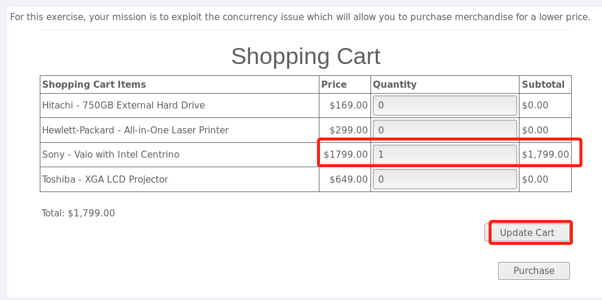
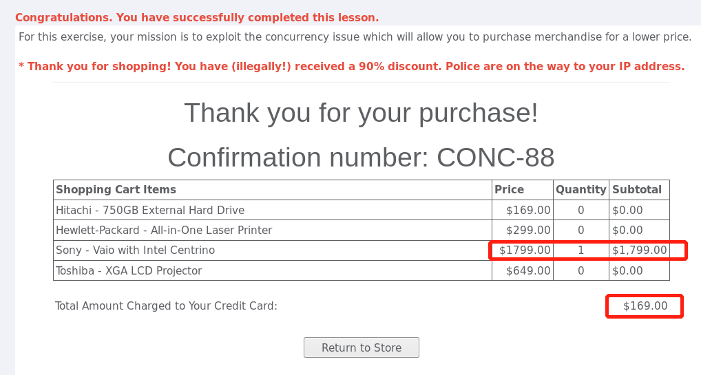
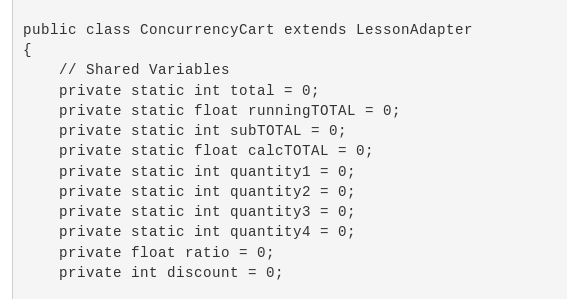

# Concurrency/`并发性`

## Thread Safety Problems `线程安全问题`

Web应用程序可以同时处理许多HTTP请求，开发人员经常使用那些不是安全线程的变量。`线程安全`意味着当多个线程同时使用时，对象或类的字段始终保持有效状态。通常可以通过在同一时间加载与另一个用户相同的页面来利用并发错误。              

由于所有线程共享相同的方法区域，并且方法区域是存储所有类变量的位置，因此多个线程可以尝试同时使用相同的类变量。

这道题是为了体验利用web开发中的并发错误，使用同一个功能在同一时间，查看另一个用户的登录信息。

开始看到这个题目时，我根本没明白题目的意思，后来查看解析说利用并发错误，同一时间登录的不同用户会得到相同的登录信息。  

需要打开另一个浏览器，模拟另一个用户登录。题目提供了两个可供登录的用户，所以每个浏览器使用一个。

   
  

 

为了保证两个登录请求`并发`，在点击提交时，尽可能地迅速。  
 

   
  

 

结果，两个不同的用户出现了一样的信息，这样的话，利用并发错误，可以轻而易举地得到其他用户的信息。  
为什么会出现这种错误呢？

看了源代码后，我发现线程并发问题的类里定义的是私有静态变量，没有线程安全的保护，前一个触发线程的浏览器的里数据都被第二个替换掉了。

   
  

 

## Shopping Cart Concurrency Flaw 购物车并发性漏洞  

这道题也是利用`并发错误`，以较低的价格买到价格高的商品。

这道题也需要用到两个浏览器，首先在一个浏览器上把价格最低的商品后数量改为1，点击purchase进入结算页面，页面显示需要付的钱是169.00  

   
  

 

在第二个浏览器中，把价格最高的商品的数量改为1，然后点击update cart 修改购物车里的内容  

   
  

 

返回到第一个浏览器点击confirm确认  

   
  

 

这样就以最低的价格买到了最贵的商品  

由于所有`线程共享`相同的方法区域，并且方法区域是存储所有类变量的位置，因此多个线程可以尝试同时使用相同的类变量。  

于是我找到了本题的源代码，发现定义的购物车的类，尝试理解一下，两个线程对购物车的操作用到的都是这个类，所以当一个线程进行操作时，另一个线程也发生了改变，所以购物车里的商品才会发生变化。

   
  

 