# Injection Flaws/注入漏洞

## `SQL注入攻击`

* `字符型`SQL注入攻击 

例：  
  

   
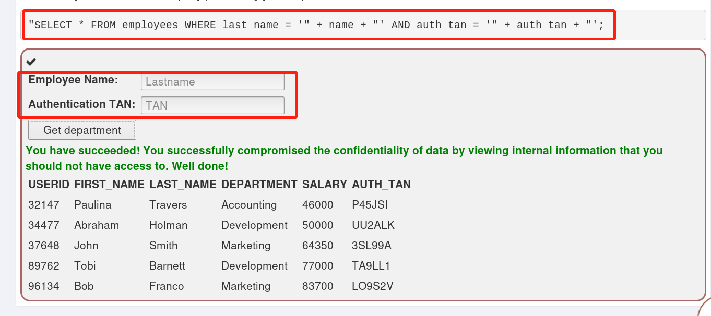  

   
  
题目要求查询员工的姓名和对应的TAN，两个框里要输入的都是字符串类型的数据。

数据库用到的查询语句是："SELECT * FROM employees WHERE last_name = '" + name + "' AND auth_tan = '" + auth_tan + "';  
  
要得到整个表的内容，两个框里都填入' or '1'=' 1  
构造的完整的语句就是："SELECT * FROM employees WHERE last_name = '' or '1'=' 1' AND auth_tan = '' or '1'=' 1';    

由于'1'='1'永远为真，所以该语句永远成立，就能查出整个表的内容。

* `数字型`SQL注入攻击  

数字型的SQL注入攻击与字符串型的类似，数据库的查询语句是："SELECT * FROM users WHERE id = 12345;

当输入的内容为 1 or 1=1 时，由于1=1永远成立，构造语句"SELECT * FROM users WHERE id = 1 or 1=1;输入的内容为真，就能查到整个表的内容。

## Numeric SQL Injection/数字型SQL注入

这道题提供了查询某一个气象站天气数据的方法，现在要求一次显示出所有气象站的天气数据。

由题目的提示已知，选择某一个气象站后，点击go！按钮，后台进行查询的语句是：SELECT * FROM weather_data WHERE station = '"+station+"'

现在在点击go！的同时，开启`burpsuite`拦截请求的信息  

   
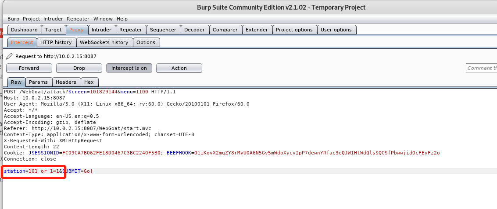  

   

通过拦截到的请求可以看到，station字段的值是数字型的，所以可以利用这一点，进行数字型的SQL注入  

将station的值改为101 or 1=1并forward回前台  

这一步就构造好了新的查询语句：SELECT * FROM weather_data WHERE station = 101 or 1=1，由于1=1恒为真，所以station的字段的值是一个真值，就能查询出整个表的内容了。

   
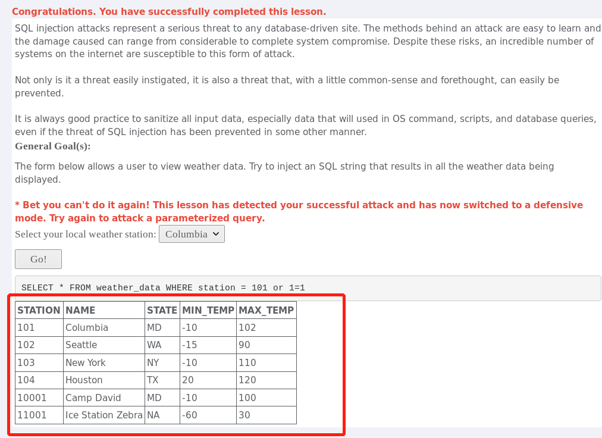  

   

##  Log Spoofing/日志欺骗

`日志欺骗`的攻击原理是：攻击的基础是在日志中欺骗人的眼睛，攻击者可以使用这种攻击从日志中擦掉自己的攻击痕迹。这道题的目的是通过向日志文件里添加脚本，让日志中的内容看起来像一个用户名为admin的用户已经成功登录

这道题中并不知道admin的密码，题目要求也不是真的让admin登录，只是在日志文件里看起来“像”是admin已经登陆成功，我先随便在user name里随便输入了一连串的内容，发现长度并没有受到限制，由于随便输入的内容，当然不可能有密码，所以密码也随意，提交之后出现下图的内容
 

   
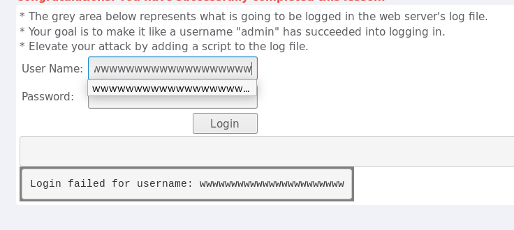  

   

`日志文件`里显示我输入的用户登录失败，且在同一行显示  

然后看到了下面的解析，解析提示文本可以添加在同一行，任何输入都是可以的，可以使用%0d和%0a，并且长度不限，转义字符在这里有什么作用吗？  

于是我试了试，用户名输入

Tom%0d%0aSuccessful login:admin,成功制造出admin登录成功的假象

   
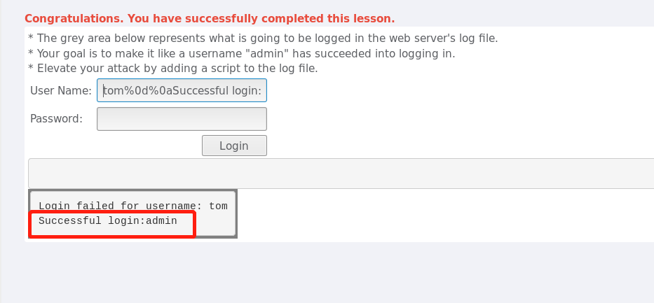  

   

## String SQL Injection/字符串型SQL注入

stage1：  

这道题是利用字符串型的SQL注入漏洞，不需要输入正确的密码就能登录到boss('Neville')的账号

   
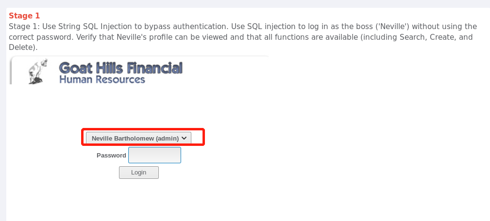  

  

首先选择要登录的账号，密码随便输入，点击login的同时开启`burpsuite`拦截登录请求，可以看出，请求里的密码字段的值是字符串型的，于是就可以构造SQL注入查询语句，因为我并不知道这些信息存储的表名，所以以table代替，类似如下：SELECT * FROM table WHERE employee_id=112 and password= '' or '1'='1   
闭合后'1'='1'为true，所以就能登录到了boss的账号上

   
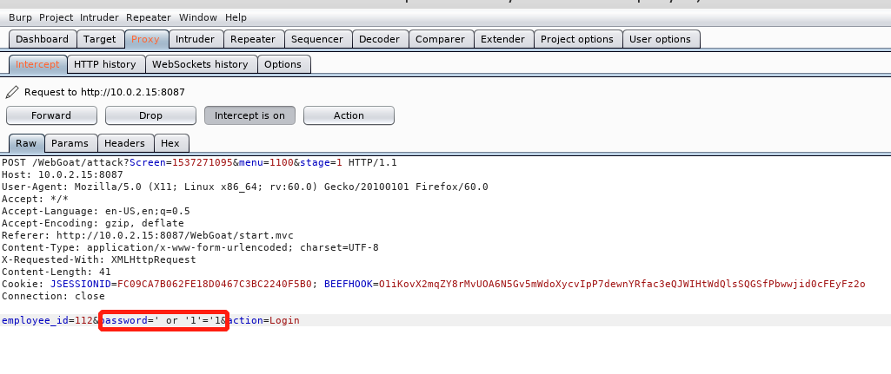  

   

可以轻而易举地对boss的账号进行操作

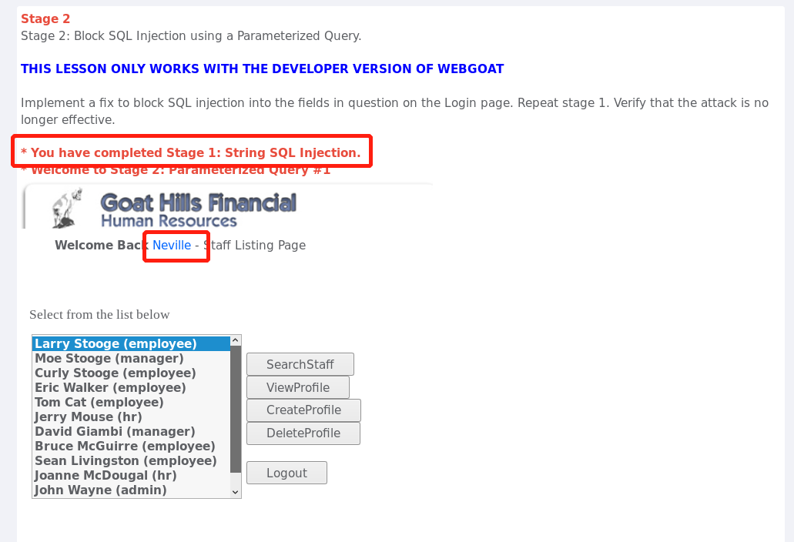  

   

stage2：

这道题要求使用一个`参数化查询`来阻止上一题的SQL注入，实现一个补丁，以阻止SQL注入登录页面上有问题的字段
什么是参数化查询，我查了一下：参数化查询（Parameterized Query 或 Parameterized Statement）是指在设计与数据库链接并访问数据时，在需要填入数值或数据的地方，使用参数 (Parameter) 来给值，这个方法目前已被视为最有效可预防SQL注入攻击 (SQL Injection) 的攻击手法的防御方式。  

但还没搞懂这道题怎么做

stage3：数字型SQL注入

这道题的要求是普通员工Larry利用数字型的SQL注入来查看boss('Neville')的资料

由于Larry只是普通员工，只有查看自己资料的权限，不能按照正常的途径查看boss的权限  

但由上边的题得到的是，员工的资料可以通过id查询，所以Larry登录自己的账号，点击ViewProfile的同时开启`burpsuite`拦截请求  
 

   
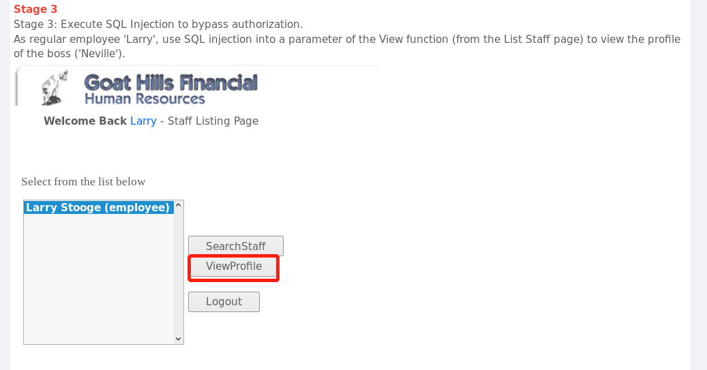  

   

拦截到请求后，对id字段进行修改，进行数字型SQL注入，我构造的查询语句类似是：SELECT * FROM table WHERE employee_id= 101 or 1=1 order by profile desc 

   
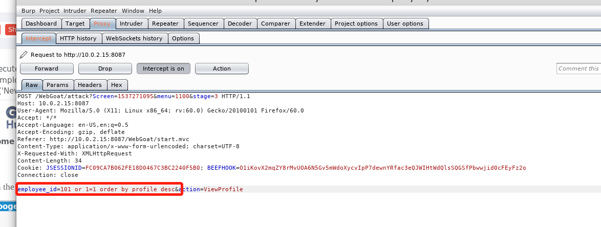  

   

然后发现错了，我理所当然地觉得题目要求查看profile就按照profile降序排列的，很明显profile并没有大小顺序，后来想起，可能按照工资排序，boss的工资应该是最多的，所以我把profile改成了salary：SELECT * FROM table WHERE employee_id = 101 or 1=1 order by salary desc，结果查询出来了！

   
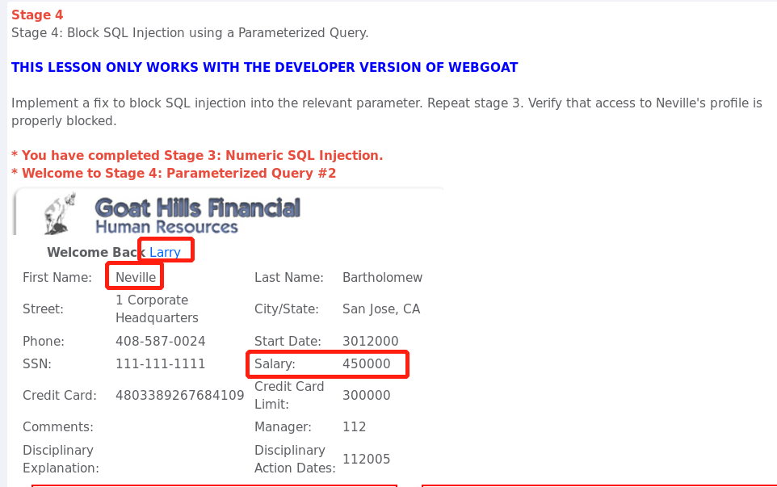  

   

## String SQL Injection

这道题是对字符串型SQL注入的练习，要求查出整个表中的内容。

原理跟上边字符串型SQL注入一样，构造查询语句为：SELECT * FROM user_data WHERE last_name = '' or '1'='1'  
就能查出整个表中的数据了

   
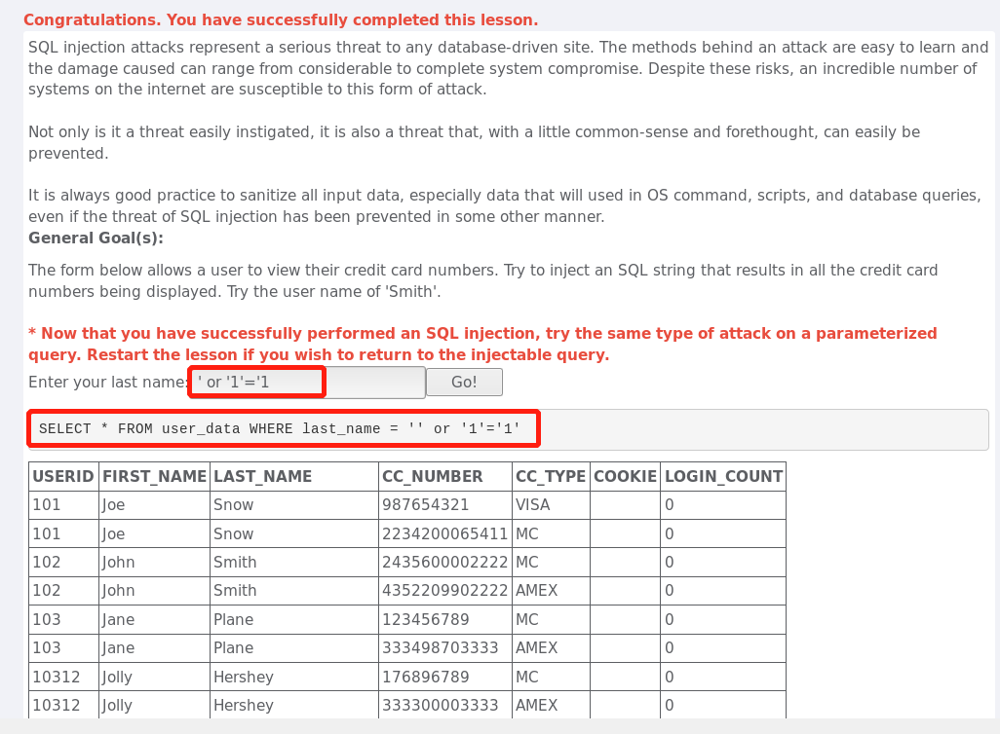  

   

webgoat8.0:

## SQL Injection（Advance）/SQL注入（高级） 

stage3：
  
`UNION 操作符`用于合并两个或多个 SELECT 语句的结果集。UNION 内部的每个 SELECT 语句必须拥有`相同数量的列`。列也必须拥有`相似的数据类型`。同时，每个 SELECT 语句中的列的`顺序`必须相同。  

UNION语法示例：SELECT First_Name from user_system_data UNION SELECT login_count FROM user_data;
        

   
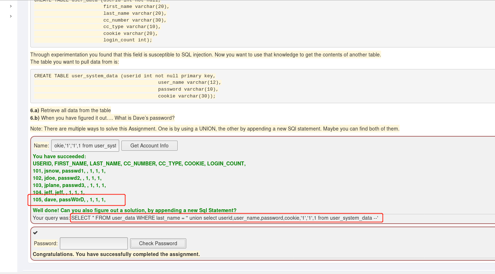  

  

在这道题里，第一个表user_data  
中总共有七列，第二个表user_system_data有四列，两个表进行UNION操作就必须有相同的列数，且对应列的数据类型相同，构造的语句是：select * from user_data where last_name=''union select userid,user_name,password,cookie,'1','1',1 from user_system_data --'   

其中，最后一列对应第一个表的最后一列，应该是数字型的数据，--表示注释掉后面的内容。

参考:  
1. https://www.runoob.com/sql/sql-union.html
