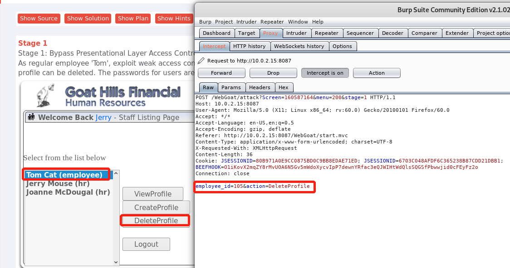
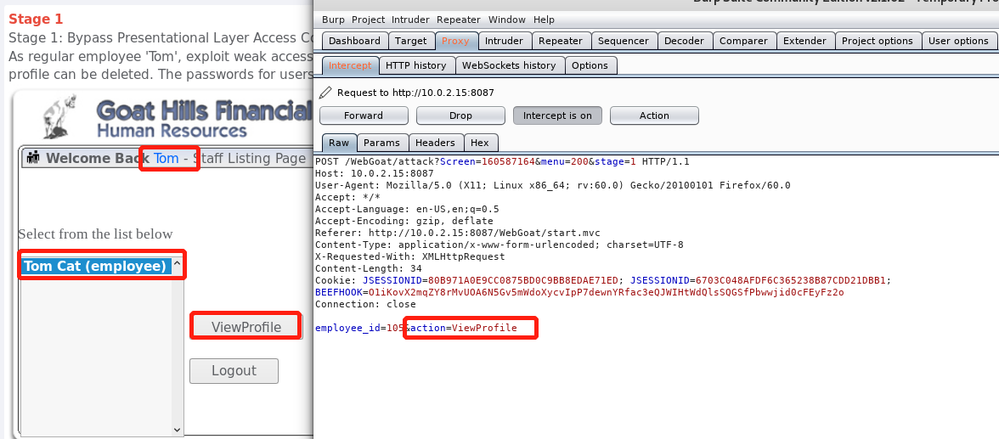
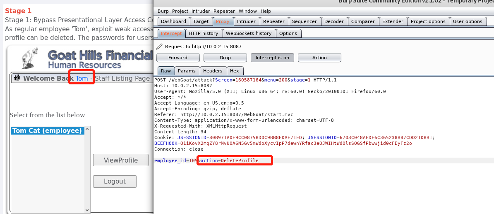
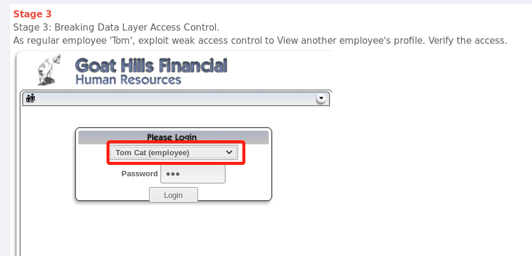
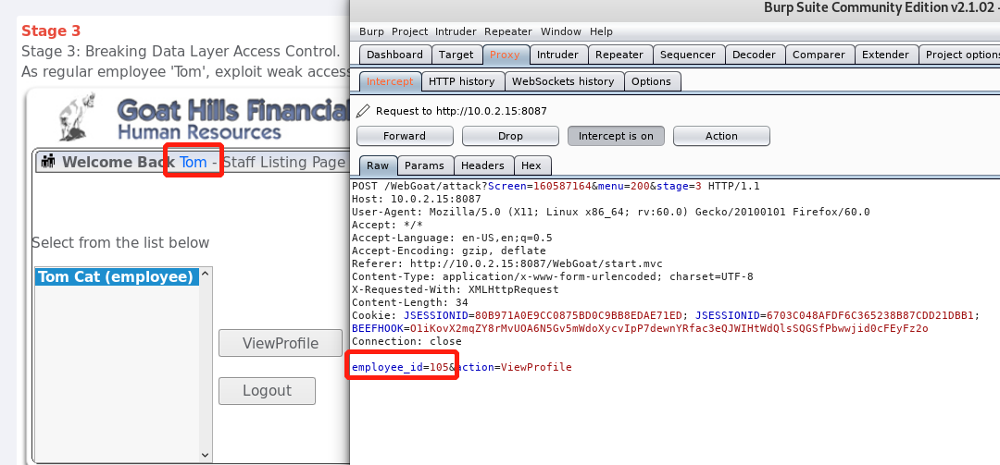
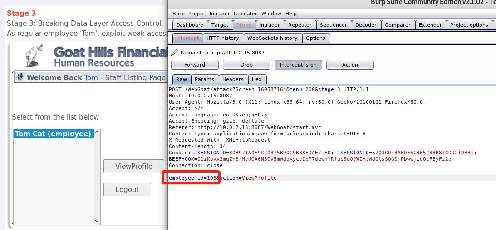
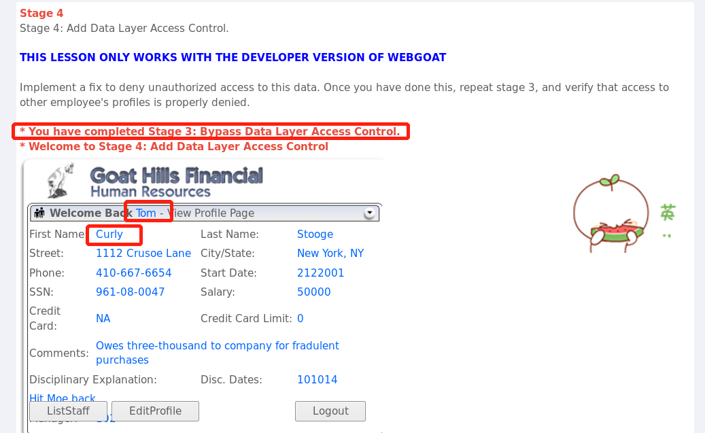

# Access Control Flaws/`访问控制缺陷`

## LAB: Role Based Access Control`基于角色的访问控制`

### stage1：绕过业务层访问控制
 
`脆弱的访问控制`的主要成因在于：内容或程序功能未能有效的保护以限制只允许合法用户的访问。
 
这道题利用的就是这一点，题目要求作为普通员工的Tom，实现他没有的删除资料的权限。
 
由题目可知，每个员工的登录密码都是各自名字的小写，所以可以登录Jerry的账号，Jerry是hr，所以能看到员工的资料，也能对员工的资料进行删除。
   
登录Jerry的账号后，选中Tom的资料，点击DeleteProfile，同时开启`burpsuite`拦截请求，可以看到，action的值为DeleteProfile。
 
那么由此联想，是不是任何一个人，如果action的值为DeleteProfile，他都可以进行删除操作呢？
 

    
  

 
为了验证这个猜想，我登录了Tom的账号，Tom是普通员工，只有查看资料的权限，选中Tom，然后点击ViewProfile，同时用burpsuite拦截刚刚的请求，可以看到，action的值为ViewProfile
 
  

    
  

 
如果将action的值改为DeleteProfile呢？  
 
将改完的请求forward回前台，Tom的资料被成功删除了
 

    
  

这道题，由于程序没有`限制合法用户的访问`，非法的用户Tom执行了他没有的权限的操作。

### stage3：绕过数据层访问控制 

这道题与第一题类似，作为普通用户的Tom，他只能查看自己的资料，如何才能查看其它员工的资料呢？
 
由第一题知道，通过修改`burpsuite`请求中的字段的值，可以实现不属于自己权限的操作，于是这道题还用第一题的思路，先登录Tom的账号
 

   
  

点击ViewProfile，同时用`burpsuite`拦截请求，可以看到，请求里有一个字段employee_id,现在的值是Tom自己的id   

   
  

  
 
那么，其他员工的id是不是也是类似的形式？  
 
于是我随便改了一个，并forward回前台
   

   
  

     
 
果然看到了其他人的资料
     

   
  

     