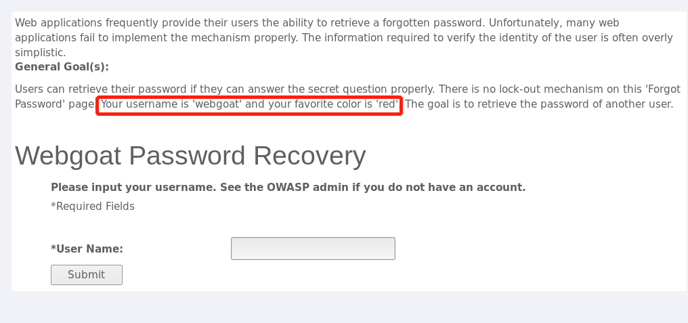
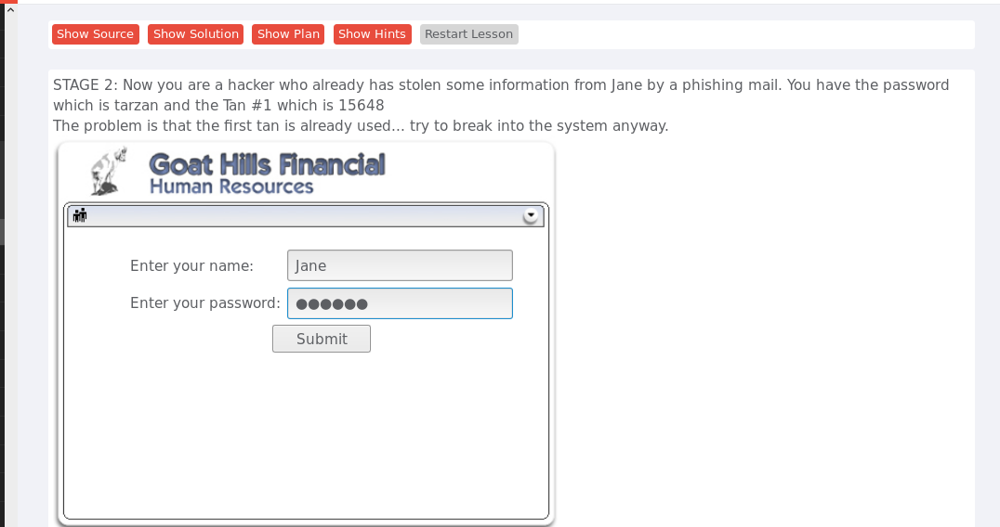

# Authentication Flaws/`身份验证缺陷`

## 忘记密码

Web应用程序经常为用户提供`检索忘记的密码`的能力但许多web应用程序未能正确实现该这种机制，验证用户身份所需的信息太过简单。这道题的目的就是尝试找回密码，体验一下`找回密码`有多容易。

   
  

   

题目已知自己的账号及找回方式，比如，账号是webgoat，找回密码需要填写最喜欢的颜色：red。由此可以推测出其他用户的找回密码的方式也是这样，本题是填写颜色的英文，但我们知道的颜色英文并不多，多试几次就试出来了。 

我在这道题里假设忘记了webgoat的密码，试了几次也就找回了密码。

   
  

   

## Multi Level Login 1/多级登陆1

`多级登陆`提供了`强身份验证`，通过添加第二层验证来达成的，这道题假设Jane使用自己的用户名和密码登录、以及第一次登录的交易身份验证号TAN1，随后黑客已经获取到了Jane的登录密码以及TAN1。现在，黑客要绕过强身份验证，用获取到的用户名、密码和已使用的TAN来登录Jane的账号。

为了保证Jane的TAN1已经被使用，先用Jane的账号密码和 TAN1登陆一次。  

TAN1被使用后，假设被黑客获取。现在黑客使用Jane的账号密码登录  

   
  

   

由于TAN已经被Jane使用过，所以黑客登录时需要填入TAN2，但黑客手里只有TAN1，填入TAN1，同时开启`burpsuite`拦截请求

   
  

   

成功拦截到登录Jane账号的请求  

   
  

   

将hidden_tan的值改为1，再forward回前台，这时候要求输入的TAN变成了TAN1，而黑客输入的TAN就是TAN1，于是成功登录Jane的账号

   
  

   

登录到Jane的账号，查看信息和卡号
 

   
  

   

通过这道题，练习了`burpsuite`的使用，了解到了有些形式的多重验证看似安全，但还是存在缺陷。

## Multi Level Login 2/多级登陆2 

这道题与上一题的区别是，黑客Joe只有自己的账号密码及TAN，但他想要登录Jane的账号。

经过上一题的启发，知道可以通过拦截请求修改字段的值，达到自己的目的，所以Joe先用自己的密码登录自己的账号

   
  

   

填写自己的TAN1，同时打开`burpsuite`拦截请求 

   
  

   

`burpsuite`拦截到的请求是Joe自己的，hidden_user的值为Joe

   
  

   

修改hidden_user的值，将其改为Jane，并forward回前台  

   
  

   

成功登录到Jane的账号

   
  

   