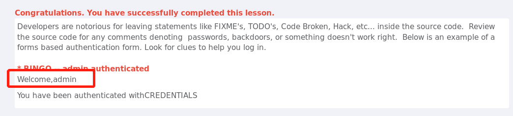

# `Code Quality`

## Discover Clues in the HTML/在`HTML`中发现线索

开发人员经常在源代码中留下`FIXME`、`TODO`、`代码损坏`、`Hack`等语句，这道题是为了检查源代码中是否有任何指示密码、后门或其他`不正常工作的注释`，下面是一个基于表单的身份验证表单的示例

   
 

由于需要看源代码，我打开了开发者工具，特意看了看题目中提示的注释，结果，果然发现了一行不太正常的注释。

   
 

这条注释里有admin：adminpw怎么看怎么像用户名和登录密码，于是我试了一下，登录成功
 

   
 

这道题中学到了源代码中可能被留下`线索`，常看看`源代码`，没准会有意外之喜。。。。